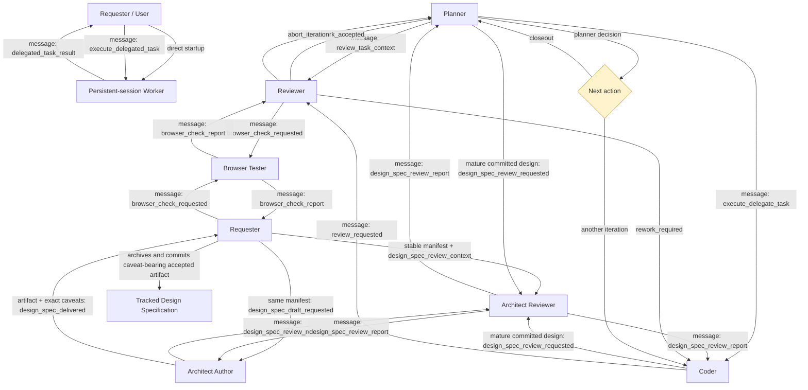

# Skills Workflow

This document describes the multi-agent workflow built around the skills in this directory.

For prompt-authoring rules and known pitfalls, see `PROMPT-WRITING.md`.

## SKILL.md Audience

`SKILL.md` is runtime instruction text for the agent executing that skill.
Write it for the agent that is doing the work now, not for the person maintaining the repo.

Keep these out of `SKILL.md`:
- prompt-authoring notes
- repo-maintenance reminders
- "this file intentionally..." explanations
- editing guidance about where future rules should live
- stale-guidance cleanup notes for future maintainers

Put those into maintenance docs such as this `README.md` instead.

Use `SKILL.md` for:
- execution steps
- runtime constraints
- decision rules the executing agent must follow
- references or scripts the executing agent should load or use

## Protocol Cutovers

Review workflow changes use a deliberate hard cut. Legacy `review_completed`,
`review-only-v2`, and Handoff recovery are unsupported. Before upgrading,
manually drain those pending deliveries; do not add runtime migration rules to
`SKILL.md`.

`agents/openai.yaml` files are Codex skill interface metadata. Keep them with the
owning skill unless replacing that skill's Codex-facing name, description, or
default prompt; they are not dead files just because this repo has no internal
reference to them.

## Explicit-Only Skills

Use explicit-only invocation for opt-in features whose primary result is a
distinct deliverable rather than a normal chat reply (currently
`explain-for-me`, `handoff`, `explore-defects`, and `assess-tech-design`). Set both:

- Claude Code `SKILL.md`: `disable-model-invocation: true`
- Codex `agents/openai.yaml`: `policy.allow_implicit_invocation: false`

Explicit `$skill` use still works. Keep receiver, protocol, and workflow skills
implicit: they may need to run from an inbound action. Codex's generic validator
currently rejects the Claude-only field; retain it as a cross-harness exception.

## Environment-Adaptive Behaviors

`browse-web` and `search-files` are normal implicit behavior skills. Their base
selectors remain complete without external CLIs; runtime appendices may add
advisory candidates declared in catalog `runtimeCommands`. Their bootstraps
refresh at the start of each matching task turn. See
`docs/ENVIRONMENT-ADAPTIVE-SKILL-GUIDANCE.md` for the composition contract.

## Roles

- Agent 1, **Planner** (`delegate-task`, `delegate-code-task`, `execute-plan`, `planner-closeout`): planning agent, chooses an execution surface, prepares execution briefs, can execute a supervisor-assigned task list inside one workspace, and completes planner-side closeout
- Supervisor: generic upstream report target; may dispatch a plan to a planner and receive one final plan report back
- Persistent-session Worker: a named host session for a bounded outcome when history must survive restarts, explicit control, later coordination, or user-visible/intervenable progress matters
- Agent 2, **Coder** (implementation): executes tasks and applies code changes
- Agent 3, **Reviewer** (`review-code`): review agent, produces the full review report directly in message body
- Agent 4, **Architect** (`review-tech-design`): per-topic reviewer for an exact immutable technical-design artifact or committed specification snapshot
- **Design Pruner** (`prune-tech-design`): optional draft-design reviewer that blocks unnecessary concepts without proposing a replacement architecture
- Agent 5, **Browser Tester** (`browser-test`): usually a reusable long-lived runtime validation agent, keeps browser state warm when available, checks behavior with `agent-browser`, and reports evidence back to the requester session
- Refactor Reviewer (`refactor-review`): advisory reviewer that inspects existing code for duplication and simplification opportunities without making changes
- Roundtable Moderator (`roundtable`): user-facing discussion controller; creates Waypost group, selects participants, drains group updates, and presents synthesis
- Roundtable Participant (`roundtable-participant`): persistent host session that reads a group stream as one participant and posts concise role-specific replies
- Intent Framer (`intent-framing` sequence mode): a user-selected persistent model that contributes through its own artifact and may exchange direct turns with the user
- User: makes acceptance decisions only when the workflow explicitly requires human gating

## Execution Surfaces

- local execution: immediate work owned by the current session
- native harness subagent: short, independent parallel work with no durable session or later message coordination
- persistent-session worker: a persistent, user-visible host session with history across restarts and explicit workspace/tool control; start it directly for user-led work, or attach Waypost when a requester needs later coordination or a result

Choose the lightest surface that preserves the task's lifecycle. Parallelism alone does not justify a persistent host session. Do not use one to emulate a native harness subagent.

`$delegate-task [$skill | skill] ...` uses only its first input token as an optional skill, classifies delivery effects, and forwards required known context/source. Code-owned work uses `delegate-code-task`.

## Core Transport

- `waypost` is the authoritative workflow message layer
- Action skills start or require target collaborator sessions through Waypost's
  generic `session_require` and `session_create` tools. `session_require`
  returns `not_found` for an absent target and supports read-only inspection
  with `auto_restart=false`; no separate resolve preflight exists.
  Waypost selects the active supported host; prompts retain the host returned
  by those tools instead of assuming Agent Deck.
- `multi-agent-protocol/references/internal-protocol/shared-protocol.md` owns recv/wait, async sender, and target-status rules
- `waypost` MCP is the default transport interface for agents
- Workflow messages live in message `subject` + `body`
- use Waypost MCP tools directly; use `waypost_bind` only when custom addresses are needed or Waypost message context is missing
- The workflow does not generate Markdown handoff files by default

## End-to-End Loop

1. User asks Planner to prepare work.
2. After `delegate-task` selects a persistent code worker, Planner runs `delegate-code-task`. Required review publishes the original task contract to Reviewer before dispatching Coder.
3. Planner or Coder may start two-architect drafting for an unresolved goal, or request direct review of mature committed design specifications.
4. Coder implements changes and commits a delivery snapshot. In delegated coder flow, that commit is already workflow-authorized and overrides generic default commit-approval rules.
5. Task-level review is planner-controlled. Delegated Coder reuses the Reviewer and planner context created at dispatch; planner-owned and standalone review may create Reviewer on demand.
6. Reviewer runs `review-code` and sends either:
   - `rework_required` back to the recorded requester (usually Coder for delegated work, Planner for planner-owned work, or the standalone review requester), or
   - `browser_check_requested` to Browser Tester, or
   - `work_accepted` to Planner for task/integration-final lanes, otherwise to the recorded standalone requester, or
   - `abort_iteration` to Planner for task/integration-final lanes, otherwise to the recorded standalone requester.
7. Browser Tester runs `browser-test`; a review-driven `browser_check_report` returns to Reviewer, otherwise to its requester.
8. Planner decides what `work_accepted` or `abort_iteration` requires: closeout, another reviewer, browser validation, a user decision, or another workflow action.
9. If another implementation round is needed, Planner dispatches it through the normal coder/reviewer path; no reviewer-specific user-iteration action is needed.
10. Planner may run `review-closeout` and then `planner-closeout` when it chooses to close out an accepted task.
11. Successful task closeout removes verified task-scoped disposable Coder and Reviewer sessions through the owning host adapter. Reusable sessions, unsupported hosts, and guard failures are preserved and reported.

## Supervisor-To-Planner Plan Execution

1. Internal supervisor orchestration follows `multi-agent-protocol/internal/dispatch-plan` and sends one `execute_plan` message to a planner. It is an internal protocol selector, not a public skill.
2. That planner owns one workspace and the internal task decomposition needed to complete the assigned goal.
3. Planner chooses local execution, a native harness subagent when available, or a persistent host session for each implementation task. Persistent Waypost code work uses `delegate-code-task`; local and harness code work use planner-owned branch, commit, review, and closeout.
4. For each task, planner may choose `Per-task review: required` or `skip`.
5. After the assigned goal is complete, planner may request one final integrated review from its own integration branch.
6. Planner sends one `plan_report_delivered` summary back to supervisor.
7. After receiving a completed report with no open items, supervisor merges the planner integration branch and reports the planner session as provider-managed.

## Roundtable Discussion Workflow

Use `roundtable` when the user wants a multi-agent discussion, brainstorm, critique, or advisory panel.

1. User talks only to the moderator.
2. Moderator clarifies intent, proposes participants, and creates a `group/roundtable-...` Waypost group.
3. Moderator registers itself as group notification subscriber with `waypost_group_add_subscriber`.
4. Participants are persistent host sessions with the moderator as their verified same-host parent, using launch candidates resolved through role `roundtable_participant`.
5. Moderator sends clarified user intent to the group and nudges selected participants with personal control messages; the first turn is parallel by default, later turns are targeted unless the user asks for sequential round-robin.
6. Participants read group unread messages with `waypost_recv` plus `as_person`, then post one group reply.
7. Group subscriber updates arrive as normal personal `group_message_available` deliveries; `route-waypost-action` resolves the action to the group route, which then runs `roundtable` Moderator Group Check.
8. Moderator presents synthesis to the user with per-participant `message_id` traceability; raw group history remains the source of truth.
9. Ending keeps sessions and Waypost message history by default. Generic workflow code does not delete provider-owned participant sessions.

## Intent Framing Workflow

`intent-framing` offers one entry with two modes. Sequence mode gives each selected model an independent artifact under one flow directory; framers run in order and may exchange direct user turns. Roundtable mode wraps the existing moderated group workflow and records its identity and syntheses beside the preserved original input. Either mode can stop and deliver its current directory at any time.

## Flow Diagram

## Operational Notes

- `review-code` remains the authoritative full review output
- `review-tech-design` reviews immutable draft artifacts or committed technical design specifications; it does not replace code review
- `tech-design-workflow` selects by design maturity: vague or undrafted work uses separate architect-author and architect-reviewer sessions; mature committed specifications may go directly to one reviewer
- in draft-review, the requester writes one canonical Design Task Contract; initial dispatch starts a pruner only when explicitly requested, while the deterministic review dispatcher lazily requires one when an artifact reaches the configured line or character threshold
- in draft-review, the author writes immutable rounds under `.agent-artifacts/design-spec/<author_session_id>/`; each reviewed file stays unchanged and reviewers remain read-only
- the author sends the terminal artifact, decision, and exact caveats in the delivery notification; the original requester applies `assess-tech-design` before committing and returning the caveats
- after the archive commit or accepted design-branch merge succeeds, the requester removes verified task-scoped disposable architect sessions through the shared host adapter and reports any preserved or pending cleanup
- draft-review does not transfer workspace ownership, switch branches, or commit intermediate rounds
- review-existing keeps committed branch history; after acceptance, merge the recorded design branch into its recorded base with normal `git merge`
- `review-request` should record coder-run lint / build / compile / test results so reviewer can usually reuse them instead of rerunning the same slow checks
- `browser-test` is primarily runtime evidence; when explicitly allowed, Browser Tester may directly adjust display-adjacent code on its own branch before reporting back
- requester should provide browser-test login/auth/setup context whenever possible; Browser Tester may ask requester or user for missing access details
- `review-closeout` is the compact planner handoff after acceptance
- `planner-closeout` is the planner-side runtime action for `closeout_delivered`
- `execute-plan` is the planner-side runtime action for a supervisor-assigned task list in one workspace
- `plan-report` is the supervisor-side runtime action for the final report from that planner
- `route-waypost-action` loads the global `action:<value>` selector named by a received `Action: <value>` field; its `group_message_available` discriminator routes `group/roundtable-*` to `roundtable`
- planner-owned coder/reviewer/architect/refactor-reviewer sessions use the verified planner parent through generic Waypost session tools
- use a persistent host session for work a user may want to observe, steer, resume, or revisit; expose its returned session id in the user-facing dispatch result
- `$explain-for-me` writes `.agent-artifacts/explain-for-me/<id>/index.html`; remote viewing uses an on-demand artifact URI or loopback/SSH tunnel.
- delegated task/integration reviewers are parented to planner, not coder; standalone reviewers are parented to requester
- Prefer same-host child sessions when the provider can represent parent ownership directly.
- A planner may be top-level outside the internal plan-dispatch protocol; do not assume every planner is a child session.
- Generic workflow contracts do not rely on host groups or provider-specific cleanup semantics.
- The receiver should always read message `body` first
- A received workflow message is executable work, not a notification to acknowledge and ignore
- Let agents discover Waypost receipt through its MCP or CLI
- Use `route-waypost-action` after receiving a Waypost message containing an `Action: <value>` field
- cross-session progress is asynchronous; follow the shared Async sender rule after dispatch
- Waypost Action bodies do not repeat transport `From` or `To`; replies use the claimed delivery's sender and recipient addresses, while action-specific identity fields remain only when workflow ownership or cleanup needs them
- in a shared workspace, the active task worktree state is coder-owned until planner closeout begins; planner must not alter that workspace state while other agents may still be working there
- when planner self-implements a trivial code task, it must create an explicit task branch from the planner-owned integration branch, commit without routine user confirmation, run any required review, close out the task, and still send `plan_report_delivered`
- planner may skip per-task review when its current plan policy allows it; final integrated review can be requested later from the planner-owned integration branch
- Use `waypost_list` with `state: acked` only when you need to find a specific older persisted delivery to reread
- External files are supplemental references only, not the default transport

## Incremental Workflow Automation

Current recommended operating mode:

1. Keep `planner` as a long-lived session.
2. Create `coder-<task_id>` as needed. Required delegated review creates `reviewer-<task_id>` before Coder dispatch; planner-owned, integration, and standalone review may create Reviewer on demand. For unresolved design, create or reuse `architect-author-<task_id>` and `architect-reviewer-<task_id>`; for mature committed design, use `architect-<task_id>`. Prefer reusing `browser-tester`, but let `browser-test-request` create it when missing.
3. Queue message first. Best-effort nudges may wake non-local targets; correctness comes from receiver-side message pickup.
   Newly created or restarted targets should use the same message recv-first pickup path as any other target.
   Keep nudge text deliberately non-assertive (`NOTICE: There might be new message in waypost.`). Harnesses can replay a nudge after the corresponding delivery was already claimed (observed with Codex; possible elsewhere). Do not replace it with a definite delivery claim: an empty receive after a nudge alone is not a transport fault and should not trigger diagnostics.
4. Default to unattended final acceptance/closeout; require user confirmation only when the user or workflow policy explicitly makes acceptance human-gated.
5. Keep transport content in message bodies. Immutable Design Specification rounds are product artifacts, not message substitutes.
6. Keep planner closeout actions batched after acceptance.
7. When supervisor finishes integrating a planner lane result, release workflow workspace state and report provider-managed sessions; do not delete them through generic workflow code.
8. Supervisor-side integration uses `git merge`; do not switch to `cherry-pick`, `rebase`, or manual history surgery unless the user explicitly asks.

Canonical workflow content:

- Project workflow skill: `multi-agent-protocol`
- Received Action router: `route-waypost-action`
- Planner closeout: `planner-closeout`
- Internal plan-dispatch protocol selector: `multi-agent-protocol/internal/dispatch-plan`
- Plan execution: `execute-plan`
- Plan report: `plan-report`
- Technical design workflow: `tech-design-workflow`
- Technical design review: `review-tech-design`
- Technical design assessment: `assess-tech-design`
- Browser check request: `browser-test-request`
- Browser tester: `browser-test`
- Audience-adapted HTML explainer: `explain-for-me`
- Internal refactor-review request selector: `refactor-review/internal/request`
- Refactor advisor: `refactor-review`
- Agent Deck integration (optional): use `agent-deck`; its host-specific docs live under its `references/`
